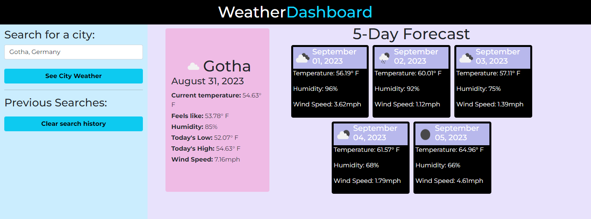

# weatherDashboard
An application to view a 5 day weather forecast.

## Project screenshots

## Deployed Github Pages Link
https://alejandra-e-bernabel.github.io/weatherDashboard/

## Github Repository
https://github.com/alejandra-e-bernabel/weatherDashboard

### How to operate the program
Enter any city name. A Google autocomplete API makes it easier to correctly input a location.

Once you press enter, you will be presented with you location's name, date, real-time weather, and a 5-day weather forecast.

### Challenges faced
When writing this application, using the Google API was a little difficult. The documentation wasn't as straightforward as I expected it to be, but I eventually figured it out and am very happy with the result. The weather API that I used was also a little difficult to get the hang of, but I definitely came out of this project with new skills to help me read documentation more carefully.

### New concepts learned
I wanted my application to have responsive layout-- specifically, I wanted previous history menu to go to the top of the screen when the screen was small. I also wanted all sections to be side by side when viewed on a larger monitor. Although this was my first time attempting it, I really like how the layout turned out and am happy with its responsiveness.
